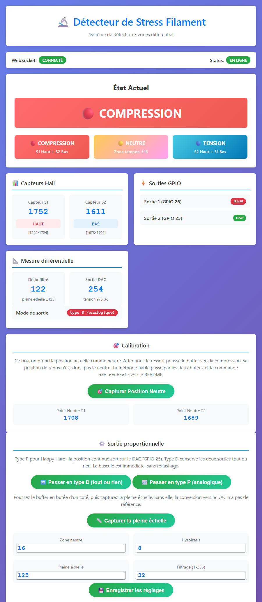
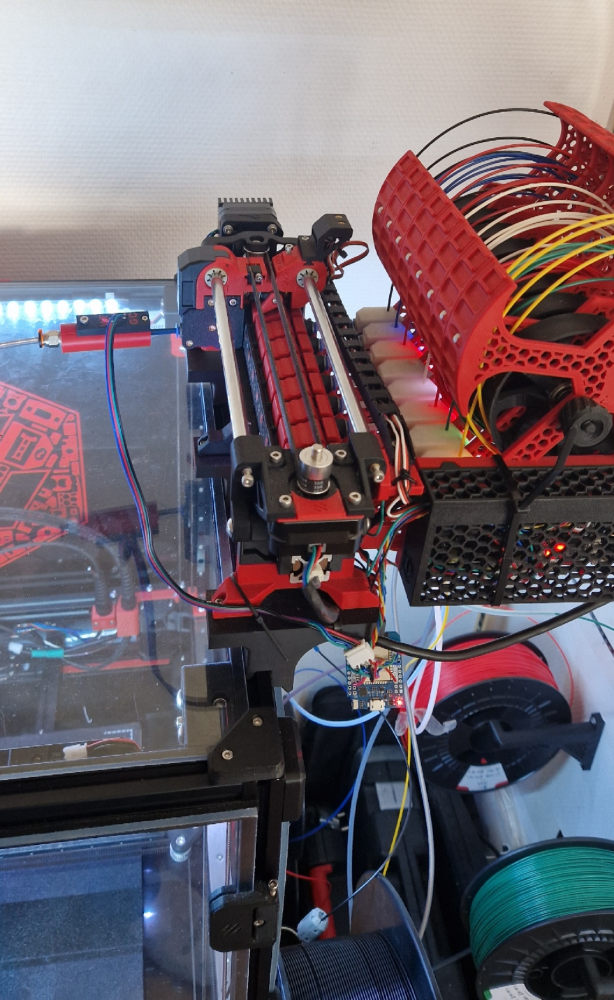
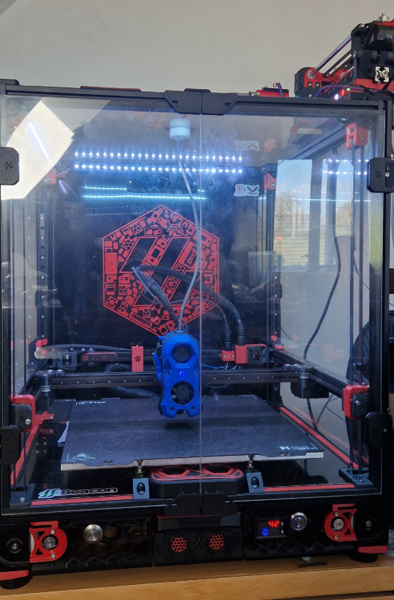

# 🔬 Détecteur de Stress Filament


## 📖 Description

Capteur de position du buffer filament, entre le MMU et l'extrudeur, pour imprimantes 3D. Deux capteurs Hall SS49E sont lus en **différentiel** par un ESP32. Le module en tire une mesure **proportionnelle** : de la tension (le filament tire) à la compression (le filament pousse), en passant par le neutre.

Le module fournit cette mesure à Happy Hare de deux façons, au choix :

| Mode du module | GPIO 25 | GPIO 26 | Mode Happy Hare |
|---|---|---|---|
| Analogique, par défaut | position continue (DAC) | compression, en tout ou rien | **type P** (proportionnel), recommandé |
| Tout ou rien | tension | compression | type D, en secours |

On passe d'un mode à l'autre depuis l'interface web, sans reflasher l'ESP32, puis on adapte la config Klipper. En mode analogique, GPIO 26 continue de signaler la compression, mais le signal de tension du type D n'existe plus : GPIO 25 porte la sortie analogique. En type P, Happy Hare règle en continu la vitesse du moteur du MMU (autotune par filtre de Kalman étendu), au lieu de la faire osciller entre deux niveaux.

**Deux variantes de la sortie analogique.** Cette branche (`sortie-dac-direct`) utilise le DAC de l'ESP32, relié directement à la carte MMU : aucun composant à ajouter, mais une plage limitée (voir l'avertissement plus bas). La branche `sortie-pwm-filtre-rc` le remplace par un PWM filtré par une résistance et un condensateur : la plage lue par Klipper est environ 2,4 fois plus large et compte 1844 niveaux au lieu de 96. Les deux variantes n'ont ni le même câblage ni les mêmes bornes Klipper.

**🔬 Basé sur :** ce projet reprend et améliore le [Voron ERCF Filament Stress Sensor](https://www.printables.com/model/803180-voron-ercf-filament-stress-sensor) de **jmillerfo**. Il est adapté à l'ESP32, avec une interface web et une intégration Happy Hare.

**🖨️ Testé sur :** Voron 2.4 R2, BIGTREETECH MMB CAN, Happy Hare v3, Kalico.

## 📸 Galerie

### Interface Web

*Interface de la variante DAC, capturée le 3 octobre 2026 sur la machine de test, buffer au repos en butée de compression. Le bloc Réseau, plus bas dans la page, n'est pas montré.*

### Capteur ESP32

*Module ESP32 avec capteurs Hall SS49E intégrés*

### Imprimante Voron 2.4 R2

*Configuration de test sur Voron 2.4 R2 avec stack BTT complet*

## ✨ Fonctionnalités

- 📏 **Mesure proportionnelle** : sortie analogique pour Happy Hare type P
- 🎯 **Sortie tout ou rien conservée** : compression, neutre ou tension, avec hystérésis
- 🧮 **Mesure différentielle** : la différence entre les deux capteurs annule la dérive thermique et les variations d'alimentation
- 🛡️ **La mesure ne dépend jamais du réseau** : le Wi-Fi ne bloque jamais la boucle de mesure
- 📶 **Wi-Fi sans recompilation** : identifiants stockés en mémoire NVS, point d'accès de repli pour les saisir
- 📊 **Interface web temps réel** : WebSocket, calibration, réglages, état du Wi-Fi
- 🔄 **Mise à jour OTA**
- 🧪 **Logique testée sur PC** : tests unitaires natifs, sans matériel

## 🛠️ Matériel requis

- **ESP32 Wemos D1 Mini 32**
- **2x capteurs Hall SS49E**
- **Alimentation 5V**, fournie par la carte MMU

## 📐 Schéma de connexion

```
ESP32 D1 Mini 32
├── GPIO 32 ──── Capteur S1 (SS49E)          entrée ADC1
├── GPIO 33 ──── Capteur S2 (SS49E)          entrée ADC1
├── GPIO 25 ──── Sortie ANALOGIQUE (DAC1)    -> Happy Hare type P
├── GPIO 26 ──── Sortie tout ou rien (DAC2)  -> Happy Hare type D, en secours
├── 3.3V   ──── VCC capteurs
└── GND    ──── GND capteurs
```

GPIO 25 et 26 sont les deux seules broches DAC de l'ESP32. En mode analogique, GPIO 25 fournit une tension continue et ne sert plus de sortie logique.

### 🔗 Connexion à la carte MMU

**Exemple sur BIGTREETECH MMB CAN :**
```
ESP32 5V                    ──► MMB 5V
ESP32 GND                   ──► MMB GND
ESP32 GPIO 25 (analogique)  ──► MMB STP8 (PB12), entrée lue par l'ADC
ESP32 GPIO 26 (secours)     ──► une entrée libre, uniquement pour le type D
```

> ⚠️ **Plage DAC limitée à 160-255.** Le DAC de l'ESP32 sait fournir du courant, mais presque pas en absorber. Sur l'entrée STP8 de la MMB, il ne parvient pas à descendre sous environ 1,9 V : en dessous de la valeur 144, la courbe se tasse puis s'inverse. Le firmware n'utilise donc que la plage 160-255, avec le neutre à 208. Les bornes à déclarer dans Klipper dépendent de la carte et de son entrée : **mesurez-les sur votre machine.** Elles valent pour un DAC relié directement à l'entrée : si vous ajoutez un filtre en série, elles sont à remesurer.

## 🖨️ Intégration Klipper / Happy Hare

### Mode proportionnel (type P), recommandé

**`mmu_hardware.cfg`**, section `[mmu_sensors]` :
```ini
sync_feedback_tension_pin:
sync_feedback_compression_pin:
sync_feedback_analog_pin: mmu:PB12
# Tensions lues par la MMB, normalisées entre 0 et 1, relevées sur la machine de test :
sync_feedback_analog_max_tension: 0.623
sync_feedback_analog_neutral_point: 0.795
sync_feedback_analog_max_compression: 0.969
```

**`mmu_parameters.cfg`**, section `[mmu]` :
```ini
sync_feedback_enabled: 1
sync_feedback_buffer_range: 12      # course utile du buffer, en mm, à mesurer
sync_feedback_buffer_maxrange: 14   # course maximale, en mm
```

Ces trois bornes sont les valeurs lues par la carte MMU quand la sortie du module est à son minimum, à son milieu et à son maximum (DAC 160, 208 et 255). Elles dépendent de la carte et du câblage, pas de la position de l'aimant. Pour les relever :

1. Calibrez d'abord le module (voir [Calibration](#calibration)), pour que les deux butées du buffer saturent la sortie.
2. Tenez le buffer en butée de tension, puis laissez-le revenir en butée de compression. Dans chaque position, lisez `value_raw` de l'objet `filament_proportional`, par exemple à l'adresse `http://<imprimante>:7125/printer/objects/query?filament_proportional`.
3. Le neutre est le milieu des deux valeurs : la réponse est linéaire sur la plage 160-255.

Ne reprenez pas les valeurs ci-dessus telles quelles. Klipper ne lit ces bornes qu'au démarrage : redémarrez-le après les avoir modifiées.

### Mode tout ou rien (type D), en secours

Désactivez la sortie analogique depuis l'interface web (commande `set_analog_output`), puis :
```ini
sync_feedback_analog_pin:
sync_feedback_tension_pin: ^mmu:<entrée reliée à GPIO 25>
sync_feedback_compression_pin: ^mmu:<entrée reliée à GPIO 26>
```

## 🚀 Installation

### 1. Cloner le dépôt
```bash
git clone https://github.com/Manu512/stress-filament-detector.git
cd stress-filament-detector
```

### 2. Compiler et téléverser
```bash
pip install platformio

pio run -e wemos_d1_mini32 -t upload      # firmware, par USB
pio run -e wemos_d1_mini32 -t uploadfs    # interface web (LittleFS)

pio run -e wemos_d1_mini32_ota -t upload    # ensuite, firmware par le réseau (OTA)
pio run -e wemos_d1_mini32_ota -t uploadfs  # et interface web par le réseau
```
Avant d'utiliser l'OTA, adaptez `upload_port` dans `platformio.ini` au nom ou à l'IP de votre module.

### 3. Configurer le Wi-Fi
Il n'y a plus d'identifiants à compiler, ni de fichier `config_private.h`.

1. Au démarrage, le module tente toujours de se connecter : avec les identifiants enregistrés, ou à défaut avec ceux que le pilote Wi-Fi de l'ESP32 a gardés d'une configuration précédente.
2. Après 3 tentatives de 15 s espacées de 20 s, soit environ une minute et demie, il ouvre un **point d'accès** nommé `stress-filament-` suivi de la fin de son adresse MAC en hexadécimal. Ce point d'accès est ouvert, sans mot de passe.
3. Connectez-vous-y, ouvrez l'interface web à l'adresse IP du point d'accès, puis saisissez votre SSID et votre mot de passe.
4. Les identifiants sont enregistrés en NVS, et le module rejoint votre réseau sous le nom d'hôte `stress-filament`.

Une fois en point d'accès, le module y reste jusqu'à la saisie de nouveaux identifiants ou jusqu'à son redémarrage. S'il perd le réseau en cours de route, il retente la connexion selon le même cycle. Pendant tout ce temps, **la mesure et les sorties continuent de fonctionner.**

## 🎮 Utilisation

### Interface web
Accessible à l'adresse IP du module, ou par son nom d'hôte si votre réseau le résout : par exemple `http://stress-filament.lan`. Elle affiche en temps réel les deux capteurs et leur zone, l'écart filtré entre eux, la valeur DAC, l'état, le niveau de tension, le mode de sortie, le réseau et l'adresse IP.

Le RSSI Wi-Fi n'est pas affiché : il n'existe que dans le statut WebSocket (`wifi_rssi`). En mode analogique, la ligne « Sortie 2 (GPIO 25) » affiche DAC : la valeur de la sortie se lit dans « Sortie DAC ».

### Calibration
Les valeurs sont **en millivolts**, lues avec `analogReadMilliVolts()`. Tant qu'aucune calibration valide n'est enregistrée, la mesure n'a pas de référence.

| Commande WebSocket | Paramètres | Effet |
|---|---|---|
| `capture_neutral` | | prend la position actuelle comme neutre |
| `capture_span` | | prend l'amplitude actuelle du delta filtré comme pleine échelle ; sans effet si elle ne dépasse pas la bande morte |
| `set_neutral` | `n1`, `n2`, `span` en option | impose le neutre, et la pleine échelle si elle est fournie ; refusé en bloc si les valeurs sont incohérentes, la calibration en service reste alors inchangée |
| `save_simple_calibration` | `deadband_points`, `hysteresis`, `span`, `alpha` (1 à 256) | règle la bande morte, l'hystérésis, la pleine échelle et le filtrage ; refusé en bloc de la même façon |
| `reset_calibration` | | remet le neutre, la pleine échelle, la bande morte et l'hystérésis par défaut, et invalide la calibration ; le filtrage et le mode de sortie sont conservés |
| `set_analog_output` | `enabled` | active ou désactive la sortie analogique |
| `set_wifi` | `ssid`, `password` | enregistre les identifiants et lance la connexion |
| `forget_wifi` | | efface les identifiants enregistrés par le module, sans couper la connexion en cours ; au redémarrage, le pilote Wi-Fi peut encore se reconnecter avec ceux qu'il a gardés |

Trois clés s'envoient sans `cmd` : `send_updates` (active ou coupe l'envoi du statut), `interval_ms` (période d'envoi, 200 ms par défaut) et `log_category` (filtre des messages de journal).

#### Procédure recommandée : par les deux butées

Le point neutre de ce buffer n'est pas sa position de repos : le ressort pousse le bras vers la compression. Le capturer à la main avec `capture_neutral` est donc peu reproductible. La méthode recommandée part des deux butées mécaniques :

1. Buffer au repos, donc en butée de compression : relevez S1 et S2 dans l'interface web.
2. Buffer tenu en butée de tension : relevez de nouveau S1 et S2.
3. Le neutre de chaque capteur est le milieu de ses deux relevés. La pleine échelle est la moitié de l'écart de `S1 - S2` entre les deux butées, diminuée de quelques unités (l'amplitude du bruit) pour que les butées saturent franchement la sortie.
4. Envoyez le résultat sur le WebSocket `/ws` : `{"cmd": "set_neutral", "n1": 1708, "n2": 1689, "span": 125}`.

Les valeurs de cet exemple sont celles de la machine de test : butées relevées à 1753 / 1607 mV et à 1662 / 1770 mV, soit une course de ±127 autour du milieu.

Refaites cette calibration chaque fois que l'aimant est déplacé. S'il n'est pas bloqué mécaniquement sur son support, il glisse, et le neutre dérive d'une impression à l'autre.

### Logique de mesure
- `delta = (S1 - neutre1) - (S2 - neutre2)`, filtré par une moyenne exponentielle.
- `delta > 0` : **compression** ; `delta < 0` : **tension**.
- La sortie analogique est proportionnelle à `delta` sur la plage DAC 160-255.
- La sortie tout ou rien applique une bande morte et une hystérésis.

## 📊 Paramètres par défaut

| Paramètre | Valeur | Description |
|---|---|---|
| Échantillonnage | 25 Hz | lecture brute à 200 Hz, moyennée par 8 |
| Neutre S1 / S2 | 1751 / 1639 mV | ordre de grandeur, à calibrer |
| Pleine échelle (`span`) | 150 | écart correspondant à la pleine échelle |
| Bande morte | ±16 | demi-largeur de la zone neutre |
| Hystérésis | 8 | marge pour quitter un état |
| Filtrage (`alpha`) | 32/256 | moyenne exponentielle |
| Plage DAC | 160-255, neutre 208 | voir l'avertissement ci-dessus |

## 🔧 Développement

### Structure du projet
```
├── src/
│   ├── main.cpp            # lecture des capteurs, sorties, serveur web
│   ├── net.h / net.cpp     # réseau non bloquant (machine à états, NVS, point d'accès)
├── lib/stress_core/        # logique de mesure pure, sans Arduino
├── test/test_stress_core/  # tests unitaires (Unity)
├── data/                   # interface web (index.html, style.css, script.js)
├── docs/                   # images de ce README
├── platformio.ini          # environnements USB, OTA et tests natifs
├── CHANGEMENTS.md          # journal technique : refonte, mesures, erreurs corrigées
└── LICENSE
```

### Tests
Tout ce qui prend une décision se trouve dans `lib/stress_core` et se teste sur PC, sans matériel :
```bash
pio test -e native
```
Il faut un compilateur C++ sur le PC (`gcc` et `g++`). Sous Windows, installez MinGW ou lancez la commande depuis WSL.

### Dépendances
- `ESP32Async/AsyncTCP`
- `ESP32Async/ESPAsyncWebServer`
- `bblanchon/ArduinoJson`

## 🤝 Contribution

Les contributions sont les bienvenues !

1. Forkez le projet
2. Créez une branche (`git checkout -b feature/AmazingFeature`)
3. Commitez vos changements (`git commit -m 'Add AmazingFeature'`)
4. Poussez la branche (`git push origin feature/AmazingFeature`)
5. Ouvrez une Pull Request

## 📄 Licence

Ce projet est sous licence MIT. Voir le fichier [LICENSE](LICENSE).

## 🛠️ Setup de développement

**Configuration de test :**
- **Imprimante :** Voron 2.4 R2
- **Contrôleur :** Raspberry Pi 4B (4GB RAM)
- **Stockage :** carte SD de 32 Go (à l'origine un HDD USB de 1 To)
- **Écran :** Waveshare 4.3" avec mod Peek-a-boo display (fbeauKmi)
- **Carte mère principale :** BTT Octopus Pro V1.1
- **Interface CAN :** BTT U2C CAN Bus Adapter
- **Carte MMU :** BIGTREETECH MMB CAN V1.1
- **Toolhead CAN :** BTT SB2209 (CAN Bus)
- **Hotend :** BambuLab X1C Hotend
- **Steppers A/B :** TMC5160 (Alimentation 48V)
- **Steppers autres :** TMC2209 (Alimentation 24V)
- **Firmware :** Kalico avec Happy Hare MMU (à l'origine Klipper)
- **MMU :** Multi-Material Unit avec gestion Happy Hare
- **Capteurs :** 2x SS49E Hall sensors positionnés sur le chemin filament

**Retour d'expérience :**
- Le mode proportionnel (type P) tourne sur cette machine avec Happy Hare v3 depuis le 24 septembre 2026. Plusieurs impressions d'une heure et demie à cinq heures sont allées à leur terme.
- Le 3 octobre 2026, une impression s'est arrêtée trois fois sur une détection de bouchon de FlowGuard, puis le filament a été retrouvé cassé dans le bowden. La cause n'est pas établie : voir `CHANGEMENTS.md`, section 9.
- L'aimant du buffer doit être bloqué mécaniquement sur son support, et la calibration refaite par les deux butées chaque fois qu'il bouge.
- L'interface web sert surtout au réglage : lecture des deux capteurs en direct, et calibration.
- Jamais mesuré : le comportement de la ligne analogique moteurs en marche, à l'oscilloscope.

## 👨‍💻 Auteur

**Manu512**
- GitHub : [@Manu512](https://github.com/Manu512)
- Projet : Détecteur de Stress Filament
- Date : octobre 2025, refonte septembre 2026 (mode proportionnel, réseau non bloquant)

## 🔗 Liens utiles

- [Happy Hare MMU](https://github.com/moggieuk/Happy-Hare) - Multi-Material Unit pour Klipper
- [Voron ERCF Filament Stress Sensor](https://www.printables.com/model/803180-voron-ercf-filament-stress-sensor) - Projet original par jmillerfo
- [Kalico](https://github.com/KalicoCrew/kalico) - Fork de Klipper
- [Documentation Klipper](https://www.klipper3d.org/) - Firmware 3D printer
- [Raspberry Pi 4B](https://www.raspberrypi.org/products/raspberry-pi-4-model-b/) - Contrôleur principal
- [Waveshare 4.3" Display](https://www.waveshare.com/4.3inch-dsi-lcd.htm) - Écran tactile DSI
- [Peek-a-boo Display Mod](https://www.printables.com/model/747183-peek-a-boo-display) - Mod d'affichage par fbeauKmi
- [BTT Octopus Pro V1.1](https://github.com/bigtreetech/BIGTREETECH-OCTOPUS-Pro) - Carte mère principale
- [BTT U2C CAN](https://github.com/bigtreetech/U2C) - Interface CAN Bus USB
- [BTT MMB CAN](https://github.com/bigtreetech/MMB) - Carte MMU CAN Bus
- [BTT SB2209](https://github.com/bigtreetech/EBB) - Toolhead CAN Board
- [TMC5160 Datasheet](https://www.trinamic.com/products/integrated-circuits/details/tmc5160/) - Drivers 48V haute performance
- [BambuLab Hotend](https://bambulab.com/) - Système hotend haute performance
- [Documentation ESP32](https://docs.espressif.com/projects/esp-idf/en/latest/)
- [PlatformIO](https://platformio.org/)
- [Capteurs Hall SS49E](https://www.allegromicro.com/en/products/sense/linear-and-angular-position/linear-hall-sensors)
- [Voron Design](https://vorondesign.com/) - Imprimantes 3D open source

---

⭐ **N'hésitez pas à mettre une étoile si ce projet vous aide !**
